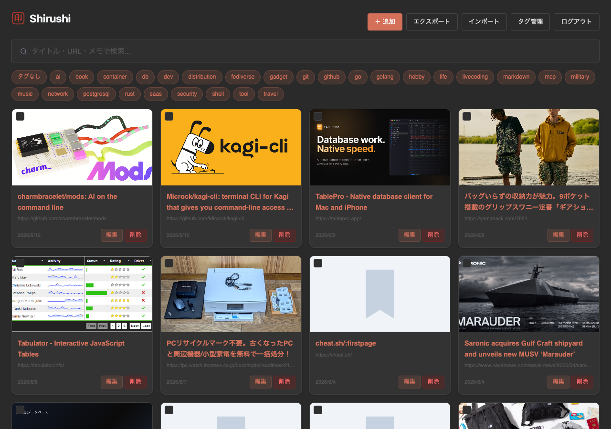

# Shirushi

Shirushi is a personal bookmark manager. Beyond saving URLs, organizing tags,
and searching, it emphasizes the flow of search → multi-select → bulk tagging
to help you cultivate a record of your interests.

It is a Go + SQLite single binary that can run on a home server (Proxmox /
Alpine Linux) and be accessed remotely through Caddy.

> **Inspired by**: [Shiori](https://github.com/go-shiori/shiori). Shirushi is
> rebuilt for bulk operations, tag management, and personal research records,
> without archiving or multi-user management.

日本語版: [README.ja.md](README.ja.md)

---

## Features

- Add, edit, and delete bookmarks
- Automatically fetch OGP metadata (title, description, and thumbnail)
- Create, edit, and delete tags, then attach them to bookmarks
- Keyword search, tag filters, and date search (for example, `202507` for July 2025)
- Choose 50, 100, or 200 items per page, with pagination above and below the list
- Multi-select bookmarks to add or remove tags in bulk, or delete them in bulk
- Import and export Netscape Bookmark files (the format exported by Chrome and Firefox)
- Password authentication for one user, with optional 30-day persistent login
- Bearer token authentication for API clients such as browser extensions
- Asynchronous 404 checks for saved URLs, with a bundled replacement thumbnail
- Optional Japanese article summaries for saved bookmarks through Henji
- A fixed dark theme

---



---

## Build

```bash
# Build for the current machine
go build -o shirushi .

# Static binary for Alpine Linux / Proxmox LXC; no CGO required
CGO_ENABLED=0 GOOS=linux GOARCH=amd64 go build -o shirushi .
```

Go 1.26.4 or later is required. The only dependency is
`modernc.org/sqlite`, a pure-Go SQLite implementation that does not require CGO.

---

## Run

```bash
SHIRUSHI_PASSWORD='yourpassword' ./shirushi
```

Then open `http://localhost:8181` in a browser.

Shirushi exits with an error if `SHIRUSHI_PASSWORD` is not set.

### Optional: article summaries with Henji

Shirushi v1.0.0 can summarize the static HTML of a saved bookmark in Japanese with a generative AI model through [Henji](https://forge.harakara.site/littleisland/henji). Henji is an optional external command: configure its provider credentials separately, then Shirushi uses `henji` on `PATH` (or a path supplied with `--henji-path`). If it is unavailable, the **AI** button is hidden and the rest of Shirushi works normally.

For setup, startup options, security boundaries, limits, and the asynchronous UI behavior, see [Henji article summaries](docs/henji-summary.md). Shirushi never stores Henji API keys or provides a provider settings screen.

```bash
# Use henji on PATH
SHIRUSHI_PASSWORD='yourpassword' ./shirushi
```

---

## Environment variables

| Variable | Default | Description |
|----------|---------|-------------|
| `SHIRUSHI_PASSWORD` | (required) | Login password. Shirushi will not start without it. |
| `SHIRUSHI_API_TOKEN` | (unset) | Bearer token for API authentication. When unset, only cookie authentication is enabled. |
| `SHIRUSHI_ADDR` | `:8181` | Listen address. Use `127.0.0.1:8181` when Caddy runs on the same host. |
| `SHIRUSHI_COOKIE_SECURE` | (unset) | Set to `1` to add the `Secure` attribute to session cookies. Set this for HTTPS deployments. |
| `SHIRUSHI_ALLOW_PRIVATE_FETCH` | (unset) | Set to `1` to disable SSRF protection while fetching metadata. Only for restricted use cases such as internal tools. |

---

## HTTPS deployment with Caddy

The intended setup runs Caddy in one LXC container and Shirushi in another.

```
Internet
  → Caddy LXC (HTTPS termination)
  → Proxmox bridge
  → Shirushi LXC (:8181)
```

**Caddyfile** (on the Caddy LXC):

```caddyfile
shirushi.example.com {
    reverse_proxy <Shirushi LXC LAN IP>:8181
}
```

**Start Shirushi** (on the Shirushi LXC):

```bash
SHIRUSHI_PASSWORD='a-long-random-password' \
SHIRUSHI_COOKIE_SECURE=1 \
./shirushi
```

You may keep the default listen address, `:8181` (all interfaces). If only
ports 80 and 443 are publicly exposed and routed through Caddy, port 8181 is
not exposed to the Internet.

> **Note**: Do not remove the XFF header with
> `header_up -X-Forwarded-For`. Without XFF, every request is treated as coming
> from the Caddy LXC IP, so failed-login counts are shared by all clients.
> Caddy's `reverse_proxy` adds XFF by default, so no extra configuration is
> normally needed.

---

## Backup and restore

The database is stored as `shirushi.db` in the same directory as the binary.

```bash
# Backup (the server does not need to be stopped)
cp shirushi.db shirushi.db.backup-$(date +%Y%m%d)

# Restore
cp shirushi.db.backup-20260614 shirushi.db
```

WAL mode also creates the auxiliary files `shirushi.db-wal` and
`shirushi.db-shm`. Copy them together with the database when backing up, or
first consolidate the WAL with `VACUUM` and then copy the database.

```bash
# Consolidate the WAL before backing up
sqlite3 shirushi.db "VACUUM;"
cp shirushi.db shirushi.db.backup-$(date +%Y%m%d)
```

---

## Test

```bash
go test -v -cover ./...
```

---

## Known limitations

- **Single user only**: Multiple accounts are not supported.
- **Sessions are kept in memory**: Restarting the server signs users out.
- **Thumbnail fetching after imports is asynchronous**: After importing a Netscape Bookmark file, OGP images are fetched in the background. For large imports, wait a while and reload the page.
- **Henji summaries are asynchronous and silent**: The UI does not show progress or completion. Reload the list later to see a completed summary.
- **No archiving**: Shirushi does not make offline copies of pages.

---

## API

For endpoint, request, response, and error-code details, see [docs/api.md](docs/api.md).

---

## Mirrors

This repository is mirrored on [Codeberg](https://codeberg.org/littleisland/shirushi).
The canonical repository is [forge.harakara.site/littleisland/shirushi](https://forge.harakara.site/littleisland/shirushi).

---

## License

[MIT](LICENSE)

## Changelog

[CHANGELOG.md](CHANGELOG.md)
